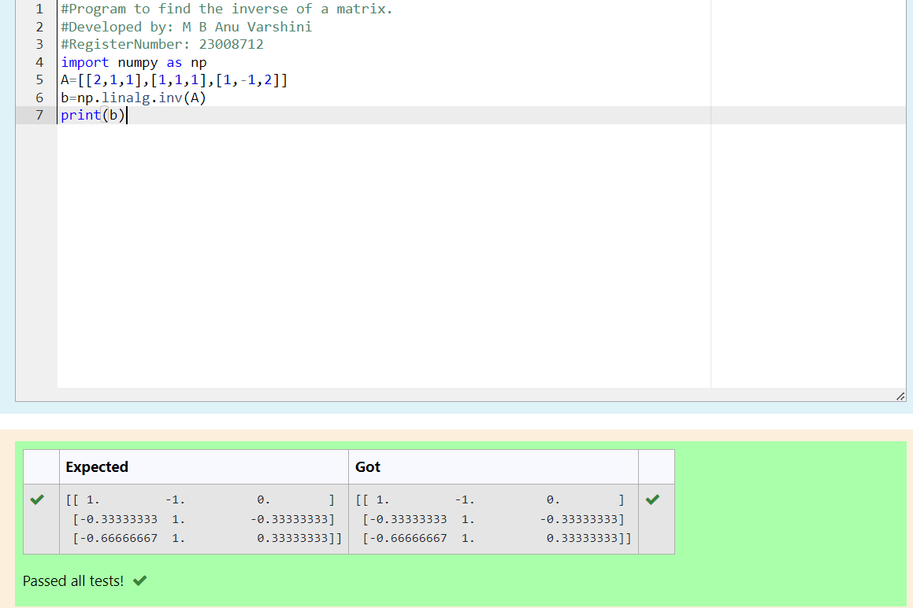

# INVERSE-OF-A-MATRIX
## Aim:
To write a python program to find the inverse of a matrix
## Equipment’s required:
1. 	Hardware – PCs
2. 	Anaconda – Python 3.7 Installation / Moodle-Code Runner
## Algorithm:
### Step1 : 
Accept a square matrix A of size (n x n).
### Step 2: 
Verify if A is square and its determinant is non-zero.
### Step 3: 
 Utilize numpy's function to calculate the matrix inverse.
### Step 4:
Print the inverse matrix or an error message if singular. 

## Program:
```PYTHON
#Program to find the inverse of a matrix.
#Developed by: M B Anu Varshini
#RegisterNumber: 23008712
import numpy as np
A=[[2,1,1],[1,1,1],[1,-1,2]]
b=np.linalg.inv(A)
print(b)
```
## Output:

## Result:
Thus the inverse of given matrix is successfully solved using python program

